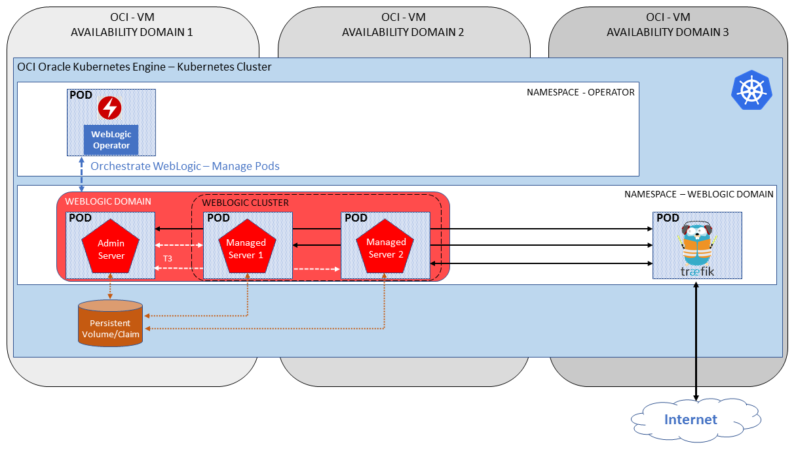

# ORACLE WebLogic on Kubernetes workshop #

### About this hands-on workshop ###

This lab demonstrates how to deploy and run WebLogic Domain on Kubernetes Cluster using [Oracle WebLogic Server Kubernetes Operator](https://github.com/oracle/weblogic-kubernetes-operator).

This lab is designed for people with no prior experience with OCI, Kubernetes, WebLogic, Container Registry, Docker and want to learn the core concepts and basics of how to run WebLogic JEE application on Kubernetes environment.

The demo application is a simple Credit Scoring application written in Java, JavaScript using Spring Boot and AngularJS frameworks. The application calculates the credit score based on name, date of birth and SSN.

Oracle services being used during the hands-on are the following:

+ **Oracle Cloud Infrastructure (OCI)** which combines the elasticity and utility of public cloud with the granular control, security, and predictability of on-premises infrastructure to deliver high-performance, high availability and cost-effective infrastructure services.
+ **Oracle Container Pipelines (OCP - former Wercker)** is a Docker-Native CI/CD  Automation platform for Kubernetes & Microservice Deployments. OCP is integrated with Docker containers, which package up application code and can be easily moved from server to server. Each build artifact can be a Docker container. The user can take the container from the Docker Hub or his private registry and build the code before shipping it. Its SaaS platform enables developers to test and deploy code often. They can push software updates incrementally as they are ready, rather than in bundled dumps. It makes it easier for coders to practice continuous integration, a software engineering practice in which each change a developer makes to the codebase is constantly tested in the process so that software doesn’t break when it goes live.
+ **Oracle Cloud Infrastructure Registry (OCIR)** is a v2 container registry hosted on OCI to store and retrieve containers.
+ **Oracle Container Engine for Kubernetes (OKE)** is an Oracle managed Kubernetes Cluster enviroment to deploy and run container packaged applications.
+ **Oracle Weblogic Kubernetes Operator** open source component to run WebLogic on Kubernetes.

The lab describes user interface available on June, 2018.

**Architecture**

### Prerequisites ###

- [Oracle Container Pipeline](tutorials/sign.up.wercker.md) account.
- [Github ](tutorials/sign.up.github.md) account.
- [Oracle Kubernetes Engine instance provisioned on Oracle Cloud Infrastructure.](tutorials/setup.oke.md) (Approximately 30 minutes)

### The topics to be covered in this hands-on session are: ###

1. [Setup WebLogic domain on Kubernetes](tutorials/setup.weblogic.kubernetes.md)
2. [Create Oracle Container Pipeline to build sample JavaEE application and deploy to WebLogic running on Kubernetes ](tutorials/sample.app.pipeline.md)

### License ###
Copyright (c) 2014-2018 Oracle and/or its affiliates
The Universal Permissive License (UPL), Version 1.0
